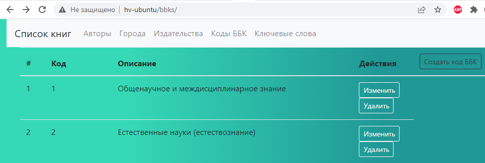
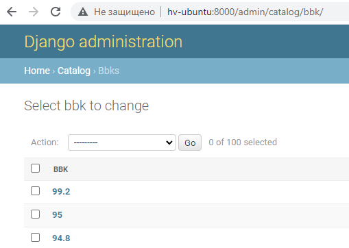
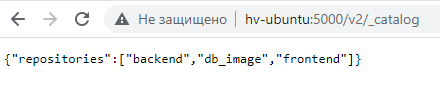

# docker_homework
# 1 Лекция
Написать Dockerfile для frontend располагается в директории /frontend, собрать и запустить
### Решение

```bash
run1.sh
```
### Результат



# 2 Лекция
Написать Dockerfile для backend который располагается в директории /lib_catalog(для сборки контейнера необходимо использовать файл /lib_catalog/requirements.txt), для работы backend необходим postgresql, т.е. необходимо собрать 2 контейнера:
1. backend
2. postgresql

Осуществить сетевые настройки, для работы связки backend и postgresql

### Решение

```bash
run2.sh
```
### Результат



# 3 Лекция
Написать docker-compose.yaml, для всего проекта, собрать и запустить

# Критерий оценки финального задания
1. Dockerfile должны быть написаны согласно пройденным best practices
2. Для docker-compose необходимо использовать локальное image registry
3. В docker-compose необходимо сетевые настройки 2 разных интерфейса(bridge), 1 - для фронта, 2 - для бека с postgresql

4.* Осущиствить сборку проекта самим docker-compose команда docker-compose build(при использовании этого подхода необходимо исключить 2 пункт из критерии оценки)

### Решение

```bash
run3.sh
```
### Результат



